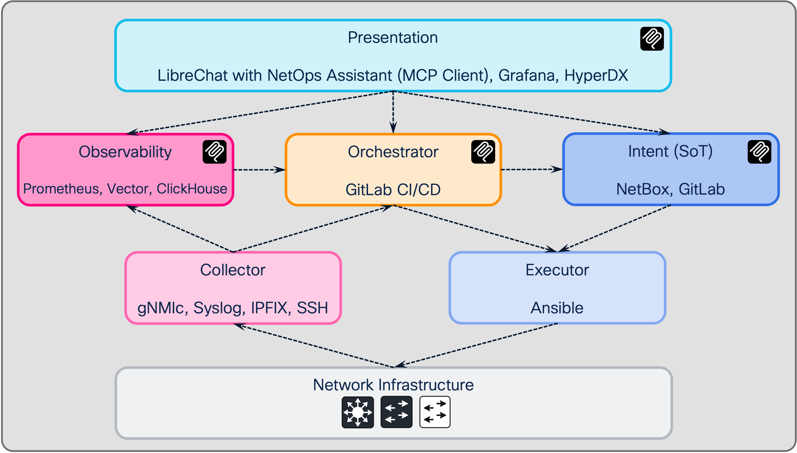

# netops-stack

> **Example code for learning and development**  
> Observability and orchestration stack for network automation. Intended for demonstration, testing, and development environments.

Observability and orchestration for **network automation**: gNMIc (gNMI streaming), Prometheus, ClickHouse (ClickStack), Grafana — plus GitLab CI/CD and Ansible for config collection, diff, apply, and rollback. Docker Compose with optional syslog and IPFIX. Built for AI/MCP troubleshooting and operational insights.

## Live Demo


*Demo: **"Troubleshoot why client at site-1 has no connectivity."** The NetOps Assistant uses the troubleshoot-site flow: resolves the site in NetBox, finds all devices at that site, then for each device runs NetBox info, Prometheus metrics (up/down), syslog (ClickHouse), and config drift. One prompt gives a full site health view to pinpoint connectivity issues.*

## Description

**netops-stack** is a composable Docker-based stack that provides:

- **Ingestion:** gNMIc (gNMI streaming), Vector (syslog UDP 514), optional IPFIX/NetFlow/sFlow
- **Storage:** ClickStack (ClickHouse + HyperDX UI), Prometheus (scrape and optional remote_write to ClickHouse)
- **Visualisation:** Grafana, HyperDX (logs, traces, metrics)
- **Orchestration:** GitLab CI/CD + Ansible — config collection, compare (drift), apply dry-run, and rollback; MCP-triggered pipelines

You choose which pieces to run via Compose overlays. The stack aligns with the [NAF (Network Automation Forum) Framework](https://reference.networkautomation.forum/Framework/Framework/#architecture) reference architecture.

## Architecture

The stack follows the [NAF (Network Automation Forum) Framework](https://reference.networkautomation.forum/Framework/Framework/#architecture): six functional blocks plus network infrastructure.

### NAF reference model

| Block | Purpose |
|-------|---------|
| **Intent** | Desired state (config, expectations). Structured data, API. |
| **Observability** | Actual state persistence and logic. Historical data, query language, drift. |
| **Orchestrator** | Coordinates automation. Event-driven, scheduling, dry-run, traceability. |
| **Executor** | Applies writes to the network (SSH, NETCONF, gNMI/gNOI). Driven by Intent. |
| **Collector** | Reads from the network (gNMI, SNMP, Syslog, flow). Feeds Observability. |
| **Presentation** | Dashboards, GUIs, CLI. Interfaces with Intent, Observability, Orchestration. |

Data flow: **Collector** → Observability; **Orchestrator** ↔ Collector; **Intent** + **Orchestrator** → Executor → **Network Infrastructure**; **Presentation** ↔ Intent, Observability, Orchestrator.

### Diagram (NAF-aligned)



### netops-stack mapping

| NAF block | Tools | In-repo / external |
|-----------|-------|---------------------|
| **Presentation** | LibreChat with NetOps Assistant (MCP Client), [Grafana](grafana/README.md), HyperDX | In-repo + [LibreChat](netops-mcp-server/README.md) |
| **Observability** | [Prometheus](prometheus/README.md), [Vector](vector/README.md), [ClickHouse](clickhouse/README.md) | In-repo (compose) |
| **Orchestrator** | [GitLab CI/CD](gitlab/README.md) | In-repo ([gitlab/](gitlab/README.md)) |
| **Intent (SoT)** | NetBox, GitLab | External + in-repo |
| **Collector** | gNMIc, Syslog, IPFIX, SSH | In-repo ([gNMIc](gnmic/README.md), [Vector](vector/README.md)) + SSH in Ansible |
| **Executor** | Ansible | In-repo ([gitlab/ansible](gitlab/README.md)): apply, rollback |

- **Presentation:** LibreChat with NetOps Assistant (MCP Client), Grafana (dashboards), HyperDX (logs/traces/metrics).
- **Observability:** Prometheus (metrics, PromQL), Vector (log pipeline), ClickHouse (logs, e.g. `default.syslog`, metrics/traces).
- **Orchestrator:** GitLab CI/CD ([gitlab/README.md](gitlab/README.md)) — collect, compare, apply dry-run, rollback; MCP-triggered pipelines.
- **Intent (SoT):** NetBox, GitLab (config baseline and desired state). Consumed via MCP.
- **Collector:** gNMIc (gNMI streaming), Syslog (Vector), IPFIX (optional), SSH (Ansible).
- **Executor:** Ansible in pipeline ([gitlab/ansible](gitlab/README.md)); MCP triggers dry-run, operator runs manual apply/rollback.

### NAF alignment (gaps and notes)

| NAF block | netops-stack | Gap / note |
|-----------|--------------|------------|
| **Intent** | NetBox | Aligned; SoT for sites, devices, interfaces, IPs. |
| **Collector** | gNMIc, Vector, optional IPFIX | Strong fit; SNMP not in stack. |
| **Observability** | Prometheus, ClickHouse, HyperDX | Strong fit; add drift/events later if needed. |
| **Executor** | Ansible (SSH) | In-repo; apply/rollback playbooks in [gitlab/ansible](gitlab/README.md). |
| **Orchestrator** | GitLab CI/CD + Ansible + GitLab MCP | Scheduled collect/diff; MCP-triggered dry-run. See [gitlab/README.md](gitlab/README.md). |
| **Presentation** | Grafana, MCP assistant | Aligned. |

**Conclusions:** Intent, Collector, Observability, and Presentation map to NetBox, gNMIc/syslog, Prometheus/ClickHouse, and Grafana/MCP. Executor is Ansible (SSH) in pipeline ([gitlab/ansible](gitlab/README.md)). Orchestrator is GitLab CI/CD + Ansible. Reference: [NAF Framework](https://reference.networkautomation.forum/Framework/Framework/).

[Documentation by folder](#documentation-by-folder) below.

## Quick start

### Prerequisites

- Docker Engine 20.10+
- Docker Compose 2.0+
- (Optional) NetBox, GitLab, and network device access for full orchestration

### Setup

```bash
# 1. Clone repository
git clone https://github.com/pamosima/netops-stack.git
cd netops-stack

# 2. Configure environment
cp .env.example .env
# Set NETOPS_STACK_HOST to the IP or hostname where the stack runs

# 3. Start base + ClickStack (HyperDX, ClickHouse, Prometheus)
docker compose -f compose.yaml -f compose-clickstack.yaml up -d

# 4. Open HyperDX (first use: create a user)
# http://<host>:8080
```

### Optional overlays

| Overlay              | Purpose                                      |
|----------------------|----------------------------------------------|
| `compose-syslog.yaml`    | Syslog → Vector → ClickHouse                 |
| `compose-ipfix.yaml`     | IPFIX/NetFlow/sFlow                         |
| `compose-iosxe.yaml`     | gNMIc config for IOS-XE / Catalyst 9k       |

**IPFIX/NetFlow/sFlow:** Use `compose-ipfix.yaml`; collector listens on host UDP 4739 (IPFIX), 2055 (NetFlow v9), 6343 (sFlow). Point devices at the host IP and the relevant port. Prometheus scrapes the IPFIX service on 8081. See `compose-ipfix.yaml` for the image and service name.

Full stack example (IOS-XE, IPFIX, syslog):

```bash
docker compose -f compose.yaml -f compose-iosxe.yaml -f compose-ipfix.yaml \
  -f compose-clickstack.yaml -f compose-syslog.yaml up -d
```

See [clickhouse/README.md](clickhouse/README.md) for deployment and ports.

## Solution components

### Observability

- **gNMIc** — gNMI streaming telemetry from network devices
- **Vector** — Syslog and log ingestion (UDP 514)
- **Prometheus** — Metrics scrape and storage
- **ClickStack** — ClickHouse + HyperDX for logs, metrics, traces
- **Grafana** — Dashboards and alerting

### Orchestration (GitLab + Ansible)

- **Config collection** — Ansible collects running config; optional commit/MR to repo
- **Compare (drift)** — Diff running vs repo baseline; optional persist `.diff` for MCP
- **Apply** — Dry-run then manual apply of config changes
- **Rollback** — Restore devices to collected baseline (Cisco configure replace or block replace)

Pipelines are triggered via GitLab API (e.g. from [network-mcp-docker-suite](https://github.com/pamosima/network-mcp-docker-suite) GitLab MCP server). See [gitlab/README.md](gitlab/README.md).

**Use cases**

With the **NetOps MCP server** (Cursor, LibreChat, etc.), prompt in natural language; the assistant uses flows and tools (compare, apply, rollback). Example prompts:

| Use case | How to prompt (MCP) |
|----------|---------------------|
| **Check drift** | *"Compare running config to baseline for sw11-1"* or *"Is there config drift on device X?"* — Triggers compare pipeline; assistant reports diff or "no changes." |
| **Apply a config change** | *"Configure X on device Y"* (e.g. *"Add VLAN 100 to sw11-1"*, *"Set NTP server on core-01"*) — Assistant reads `netops://flows/configuration`, gets running config, builds desired block, uploads to `ansible/configs/desired/<host>.txt` and triggers apply dry-run; you review the job log and run manual **apply_config** in GitLab. |
| **Refresh baseline** | *"Refresh the config baseline from devices"* or *"Collect running configs and update baseline"* — Triggers collect pipeline; add *"and create a merge request"* to open an MR. |
| **Roll back to baseline** | *"Roll back sw11-1 to baseline"* or *"Restore device X to last collected config"* — Triggers rollback pipeline; dry-run shows diff, then you run manual **rollback_apply** in GitLab. |
| **Troubleshoot a device** | *"Troubleshoot sw11-1"* or *"Why is device X having issues?"* — Assistant runs troubleshoot flow (NetBox + Prometheus + ClickHouse + optional compare/diff); use *"run compare pipeline"* if you want a fresh drift check. |

Details: [netops-mcp-server/README.md](netops-mcp-server/README.md) (flows, tools, resources). Pipeline variables and manual jobs: [gitlab/README.md](gitlab/README.md).

### MCP integration

- **Prometheus MCP** — Query metrics (netops-stack Prometheus)
- **ClickHouse MCP** — Query syslog and logs (netops-stack ClickHouse)
- **GitLab MCP** — Trigger compare, apply dry-run, rollback pipelines

Use the **netops-stack** profile in [network-mcp-docker-suite](https://github.com/pamosima/network-mcp-docker-suite) to run MCP servers that connect to this stack.

## Documentation by folder

Documentation lives in each component folder. Start here:

| Folder | README | Contents |
|--------|--------|----------|
| [gitlab/](gitlab/README.md) | [README](gitlab/README.md) | Orchestrator: Ansible + GitLab CI/CD, pipeline setup, rollback (configure replace, NETCONF), MCP |
| [clickhouse/](clickhouse/README.md) | [README](clickhouse/README.md) | ClickStack: HyperDX, ClickHouse, syslog table, ports, deploy |
| [vector/](vector/README.md) | [README](vector/README.md) | Syslog ingestion, device config (Cisco), IPFIX pointer |
| [gnmic/](gnmic/README.md) | [README](gnmic/README.md) | gNMI streaming, IOS-XE targets, subscriptions |
| [prometheus/](prometheus/README.md) | [README](prometheus/README.md) | Scrape config, metrics, MCP |
| [grafana/](grafana/README.md) | [README](grafana/README.md) | Dashboards, provisioning |
| [nats/](nats/README.md) | [README](nats/README.md) | Message bus for gNMIc pipeline |
| [netops-mcp-server/](netops-mcp-server/README.md) | [README](netops-mcp-server/README.md) | MCP server: GitLab, Prometheus, ClickHouse, NetBox, IOS-XE, flows |

- **Deployment:** [DEPLOYMENT.md](DEPLOYMENT.md)

## Management commands

```bash
# Start stack (choose overlays as needed)
docker compose -f compose.yaml -f compose-clickstack.yaml up -d

# View status
docker compose ps

# View logs
docker compose logs -f

# Stop
docker compose down
```

## Security considerations

See **[SECURITY.md](SECURITY.md)** for vulnerability reporting, supported versions, and branch-protection guidance (OpenSSF-aligned). This repo uses **CodeQL** (`.github/workflows/codeql.yml`) and **Dependabot** (`.github/dependabot.yml`).

- No hardcoded credentials; use `.env` and GitLab CI/CD variables
- Store `ANSIBLE_USER`, `ANSIBLE_PASSWORD`, `GITLAB_PUSH_TOKEN`, NetBox tokens in CI variables (masked)
- Python deps: lockfiles — `netops-mcp-server/uv.lock`, compiled `gitlab/requirements.txt` / `clickhouse/requirements-export.txt`; Docker base images pinned by digest
- For production: use secrets management, restrict network access, and follow [gitlab/README.md](gitlab/README.md) hardening

**After CodeQL / Dependabot run:** resolve open alerts (`gh api repos/<owner>/<repo>/code-scanning/alerts`, `.../dependabot/alerts`) or merge safe update PRs.

## Kudos

- **Telemetry:** The telemetry idea in this stack draws on **[gnp-stack](https://github.com/Untersander/gnp-stack/)** — the gNMIc–NATS–Prometheus stack for network telemetry. Thanks to that project for pioneering a “point and shoot” streaming-telemetry experience.
- **Presentation:** *Network Observability Redefined with a Modern Open-Source Pluggable Tech-Stack* — Jan Untersander, Ramon Bister, Sascha Häring (OST/INS), [CHNUG #1](https://chnug.ch/chnug001/) (4 Dec 2025 @ OST).

## Contributing

Contributions are welcome. See [CONTRIBUTING.md](CONTRIBUTING.md) for how to report issues and suggest improvements. This project adheres to the [Contributor Covenant Code of Conduct](CODE_OF_CONDUCT.md).

## License

This project is licensed under the **Cisco Sample Code License, Version 1.1** — see the [LICENSE](LICENSE) file for details.

## Disclaimer

This project is **example code** for demonstration and learning. It is not officially supported by Cisco Systems and is not intended for production use without proper testing and customization for your environment.

Third-party components (Grafana plugins, Ansible collections, etc.) are subject to their own licenses; see component documentation and the [NOTICE](NOTICE) file.
