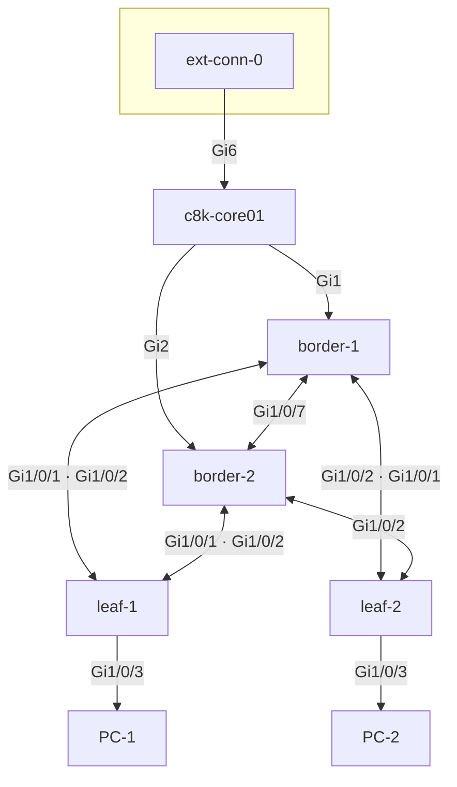

# Cisco Modeling Labs (CML) topology

This folder holds **lab topology definitions** for [Cisco Modeling Labs](https://developer.cisco.com/modeling-labs/) (CML 2.x), aligned with the rest of netops-stack (gNMI telemetry, Ansible inventory, NetBox seed data).

## Contents

| File | Description |
|------|-------------|
| `BGP-EVPN.yaml` | Full lab export: BGP EVPN / VXLAN fabric with **IOS-XE** nodes (e.g. Border, Leaf, Catalyst 8000v core). Includes embedded node configurations. |

## Topology (`BGP-EVPN.yaml`)

Eight nodes; interconnects match the `links:` section in the YAML.

| Role | Node | Notes |
|------|------|--------|
| External | **ext-conn-0** | CML external connector → core **GigabitEthernet6** |
| Core | **c8k-core01** | Catalyst 8000v; uplinks to both borders |
| Border / spine | **border-1**, **border-2** | C9KV; **Gi1/0/7** border-to-border; **Gi1/0/8** to core |
| Leaf | **leaf-1**, **leaf-2** | C9KV; each leaf dual-homed to **both** borders |
| Endpoint | **PC-1**, **PC-2** | Linux; **ens2** to **leaf-1** / **leaf-2** **Gi1/0/3** |



ASCII overview (same layout):

```
                         ┌─────────────┐
                         │ ext-conn-0  │
                         └──────┬──────┘
                                │ Gi6
                         ┌──────▼──────┐
                         │ c8k-core01  │
                         └───┬────┬────┘
                    Gi1     │    │     Gi2
              ┌─────────────┘    └─────────────┐
              │                                │
        ┌─────▼─────┐    Gi1/0/7     ┌─────────▼─────┐
        │ border-1  │◄══════════════►│  border-2     │
        └──┬────┬───┘                └───┬────┬────┘
           │    │                        │    │
           │    └──────────┬─────────────┘    │
           │               │                  │
      Gi1/0/1         Gi1/0/2            Gi1/0/2 …
           │               │                  │
           └───────┬───────┴────────┬─────────┘
                   │                │
              ┌────▼────┐      ┌────▼────┐
              │ leaf-1  │      │ leaf-2  │
              └────┬────┘      └────┬────┘
                   │ Gi1/0/3       │ Gi1/0/3
              ┌────▼────┐      ┌────▼────┐
              │  PC-1   │      │  PC-2   │
              └─────────┘      └─────────┘
```

*Each leaf has one link to each border (full dual-homing); interface IDs are in the YAML link labels.*

## Import into CML

1. In CML **Workbench**, use **Import** (or **File → Import topology** depending on version).
2. Select `BGP-EVPN.yaml`.
3. Adjust **image references** and **node definitions** if your CML server uses different image names or quotas.
4. Start the lab and wait for nodes to boot; management reachability depends on your CML **external connector** / bridge setup.

## Relation to netops-stack

- **Management IPs** in this lab typically use the CML **198.18.0.0/15** range (e.g. `198.18.170.x`). Match those addresses in:
  - [`gnmic/gnmic-ingestor.yaml`](../gnmic/gnmic-ingestor.yaml) (gNMI targets),
  - GitLab/Ansible inventory if you automate against the same lab.
- **NetBox:** The [`netbox/`](../netbox/) folder contains CSV/YAML exports that mirror device names and primary IPs for this fabric (e.g. `border-1`, `leaf-1`, `Fabric Site`).

## Notes

- Topology exports can be large (full configs embedded). Prefer **git LFS** or sparse checkouts if size is an issue.
- After CML upgrades, re-validate node images and interface naming against your target IOS-XE version.
- Do not commit real production credentials inside topology YAML; use lab-only users consistent with your security policy.

## See also

- [NetBox import data → `../netbox/README.md`](../netbox/README.md)
- [gNMIc → `../gnmic/README.md`](../gnmic/README.md)
